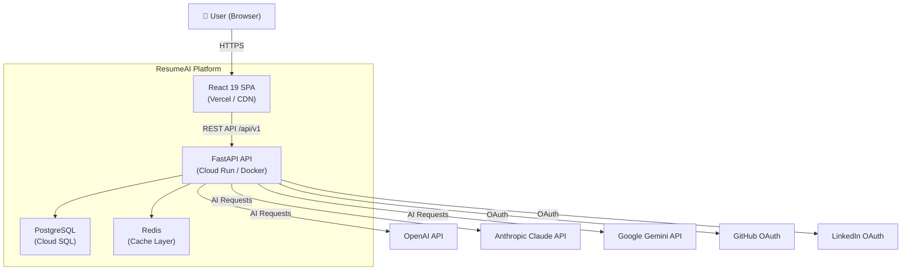
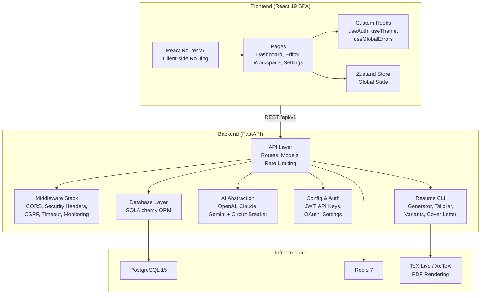
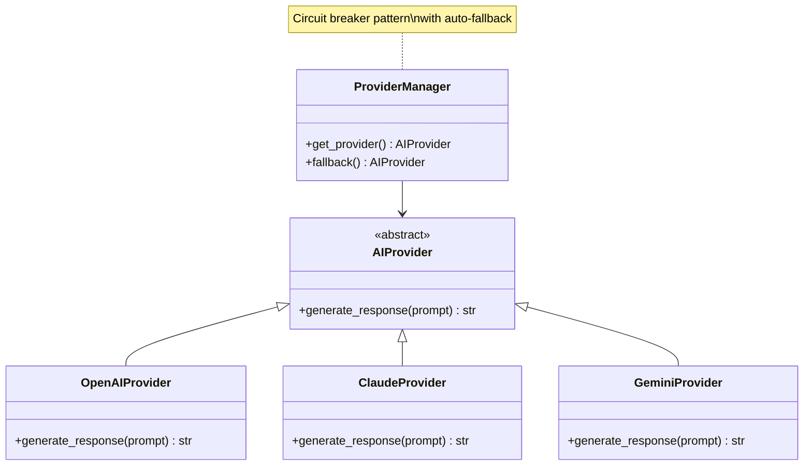
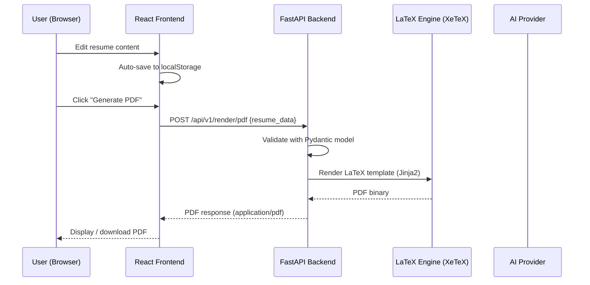
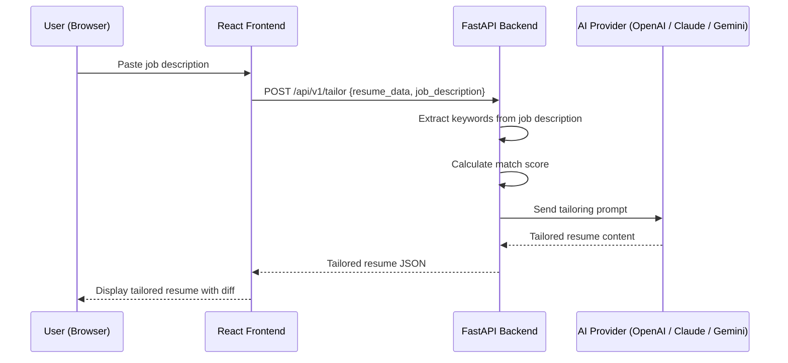
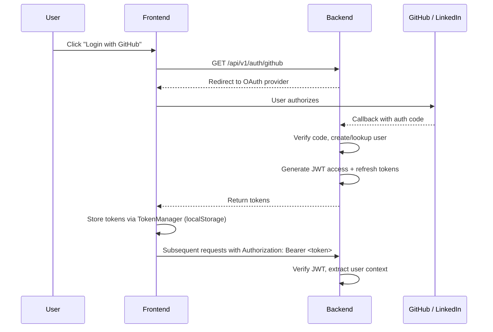
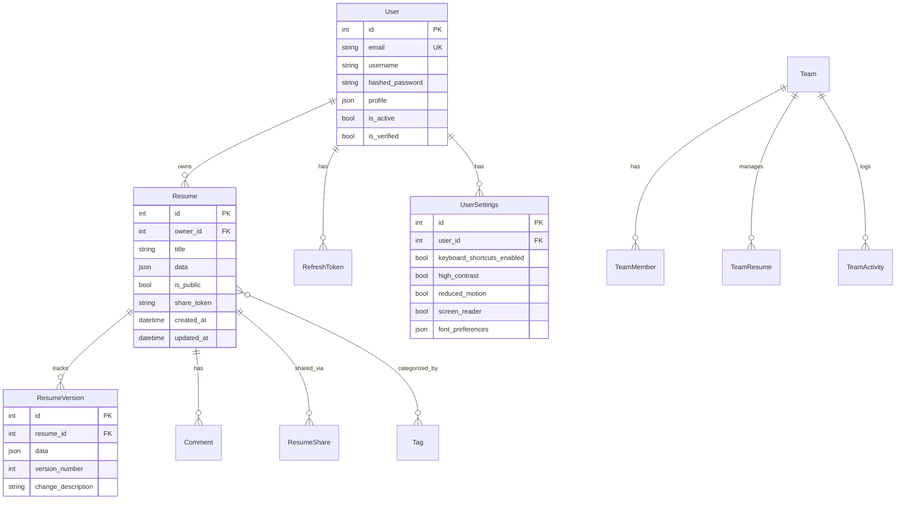
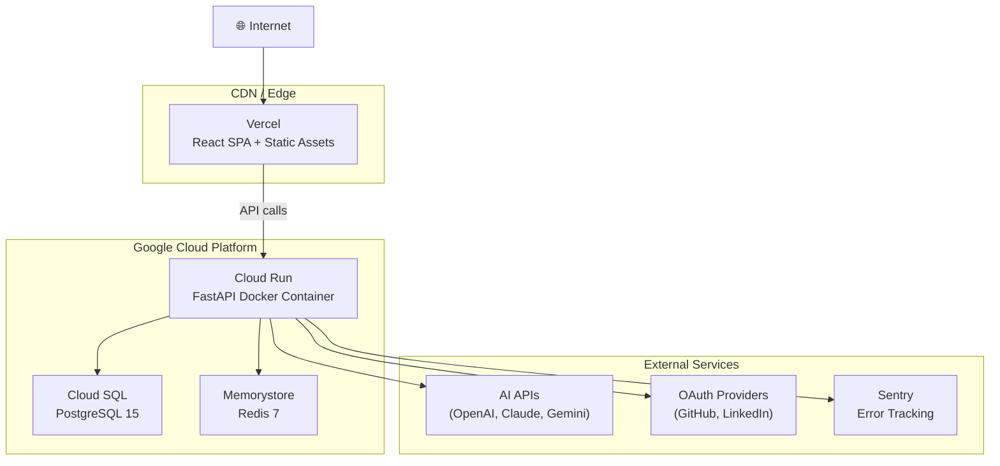

# Architecture Overview

This document provides a comprehensive overview of the ResumeAI system architecture for developers, stakeholders, and DevOps engineers.

## Table of Contents

- [System Overview](#system-overview)
- [Architecture Diagram](#architecture-diagram)
- [Technology Stack](#technology-stack)
- [Frontend Architecture](#frontend-architecture)
- [Backend Architecture](#backend-architecture)
- [Data Flow](#data-flow)
- [Authentication & Authorization](#authentication--authorization)
- [Database Schema](#database-schema)
- [Deployment Architecture](#deployment-architecture)
- [Monitoring & Observability](#monitoring--observability)
- [Key Architectural Decisions](#key-architectural-decisions)
- [Scalability Considerations](#scalability-considerations)
- [Related Documentation](#related-documentation)

---

## System Overview

ResumeAI is a full-stack SaaS application that helps users create professional resumes with AI-powered enhancements. The system is composed of two primary components:

| Component | Technology | Responsibility |
|-----------|-----------|----------------|
| **Frontend** | React 19 + TypeScript + Vite | Single Page Application — resume editing, dashboard, settings |
| **Backend** | FastAPI + Python 3.11 | REST API — resume generation, AI tailoring, PDF rendering, auth |

Users interact with a React SPA that communicates with a FastAPI backend over HTTPS. The backend integrates with multiple AI providers (OpenAI, Anthropic Claude, Google Gemini) for resume tailoring, uses LaTeX (via TeX Live / XeTeX) for PDF generation, and stores data in PostgreSQL with Redis caching.

---

## Architecture Diagram

### High-Level System Context (C4 Level 1)



### Container Diagram (C4 Level 2)



---

## Technology Stack

### Frontend

| Technology | Purpose |
|-----------|---------|
| **React 19** | UI framework with concurrent features |
| **TypeScript** | Type-safe JavaScript (strict mode) |
| **Vite** | Build tool and dev server with HMR |
| **Tailwind CSS** | Utility-first CSS framework |
| **Zustand** | Lightweight state management |
| **React Router v7** | Client-side routing |
| **Vitest** | Unit and component testing |
| **Playwright** | End-to-end testing |
| **ESLint + Prettier** | Code quality and formatting |

### Backend

| Technology | Purpose |
|-----------|---------|
| **FastAPI** | Async Python web framework |
| **Python 3.11** | Runtime environment |
| **Pydantic v2** | Request/response validation, settings management |
| **SQLAlchemy** | ORM for database access |
| **PostgreSQL 15** | Primary relational database |
| **Redis 7** | Caching and session storage |
| **TeX Live / XeTeX** | LaTeX-based PDF resume rendering |
| **Jinja2** | LaTeX template engine |
| **python-jose** | JWT token handling |
| **passlib (bcrypt)** | Password hashing |
| **Fernet** | Symmetric token encryption |
| **Pytest** | Backend testing |
| **Black + Flake8 + mypy** | Formatting, linting, type checking |

### AI Providers

| Provider | SDK | Use Case |
|----------|-----|----------|
| **OpenAI** | `openai` | Resume tailoring (default, GPT-4o) |
| **Anthropic Claude** | `anthropic` | Alternative AI provider |
| **Google Gemini** | `google-generativeai` | Alternative AI provider |

### Infrastructure & DevOps

| Technology | Purpose |
|-----------|---------|
| **Docker** | Containerization (multi-stage builds) |
| **Docker Compose** | Local dev, production, monitoring stacks |
| **Kubernetes / Helm** | Orchestration and deployment charts |
| **Prometheus** | Metrics collection |
| **Grafana** | Metrics visualization and dashboards |
| **Alertmanager** | Alert routing and notifications |
| **OpenTelemetry** | Distributed tracing |
| **Sentry** | Error tracking and monitoring |
| **GitHub Actions** | CI/CD pipelines |

---

## Frontend Architecture

### Page Structure

The SPA uses React Router v7 with lazy-loaded pages and Suspense boundaries for code-splitting:

| Page | Route | Description |
|------|-------|-------------|
| Dashboard | `/` | Overview, recent resumes, quick actions |
| Editor | `/editor` | Visual resume editing interface |
| Workspace | `/workspace` | Resume management and organization |
| Job Applications | `/jobs` | Job application tracking |
| Settings | `/settings` | User preferences and account settings |
| Interview Practice | `/interview` | AI-powered interview prep |
| Salary Research | `/salary` | Salary data and insights |
| Billing | `/billing` | Subscription and payment management |

### State Management

- **Zustand store** — Global application state (auth, UI, save status)
- **localStorage** — Resume data persistence, auth tokens (via `TokenManager`)
- **Save status tracking** — `'idle' | 'saving' | 'saved' | 'error'`

### Error Handling

- `ErrorBoundary` components protect component trees from render crashes
- `useGlobalErrors` hook for application-wide error notification
- Sentry integration for production error tracking and user context

### Performance

- Lazy loading via `React.lazy()` + `Suspense` for route-based code splitting
- Prefetch system (`registerPrefetch`) for anticipated navigation
- Web Vitals collection (Core Web Vitals / Lighthouse metrics)
- `React.memo`, `useCallback`, and `useMemo` for render optimization

---

## Backend Architecture

### Middleware Stack

Requests pass through the following middleware chain (in order):

```
Request
  │
  ├─ ErrorHandlingMiddleware      → Catches unhandled exceptions
  ├─ MonitoringMiddleware         → Trace IDs, request metrics
  ├─ SecurityHeadersMiddleware    → HSTS, CSP, X-Frame-Options, XSS protection
  ├─ CSRFMiddleware               → Cross-site request forgery protection
  ├─ RequestSigningMiddleware     → Request integrity verification
  ├─ TimeoutMiddleware            → 30-second default request timeout
  └─ CORSMiddleware               → Configurable origin allowlist
  │
  ▼
Route Handler
```

### API Endpoints

All routes are prefixed with `/api/v1`:

| Endpoint | Method | Description | Rate Limit |
|----------|--------|-------------|------------|
| `/render/pdf` | POST | Generate PDF from resume data | 10/min |
| `/tailor` | POST | AI-powered resume tailoring | 30/min |
| `/variants` | GET | List resume template variants | 60/min |
| `/export/docx` | POST | Export resume to Word format | — |
| `/import/pdf` | POST | Parse uploaded PDF resume | — |
| `/import/docx` | POST | Parse uploaded Word resume | — |
| `/health` | GET | Basic liveness check | — |
| `/health/detailed` | GET | Full component status | — |
| `/health/ready` | GET | Readiness probe for load balancers | — |

Additional feature routes: interviews, salary research, LinkedIn integration, billing, team collaboration, analytics, webhooks, API key management, and deployment status.

### Resume CLI Integration

The backend wraps a Python CLI library in `resume-api/lib/cli/`:

| Module | Responsibility |
|--------|---------------|
| `ResumeGenerator` | Renders PDF from resume data via LaTeX/Jinja2 templates |
| `ResumeTailorer` | AI-powered resume customization for job descriptions |
| `VariantManager` | Manages multiple resume template variants |
| `CoverLetterGenerator` | Generates cover letters from resume data |

The `ResumeGenerator` uses Jinja2 with custom LaTeX block syntax (`\BLOCK{}`, `\VAR{}`) and applies LaTeX escaping to prevent injection in rendered documents.

### AI Provider Abstraction



Each provider has a dedicated circuit breaker. If the primary provider fails, the system automatically falls back to an alternative provider. Keywords are extracted using NLP with stop-word filtering and frequency-sorted ranking.

---

## Data Flow

### Resume Generation (PDF)



### AI-Powered Resume Tailoring



### Authentication Flow



---

## Authentication & Authorization

The system supports multiple authentication mechanisms:

| Method | Use Case | Header |
|--------|----------|--------|
| **API Key** | Third-party integrations, frontend-to-backend | `X-API-KEY: rai_xxx` |
| **JWT Bearer Token** | Authenticated user sessions | `Authorization: Bearer <token>` |
| **OAuth 2.0** | Social login (GitHub, LinkedIn) | Redirect flow |

- **API Keys**: Master key for the frontend app, additional keys for third-party developers
- **JWT Tokens**: 30-minute access tokens, encrypted refresh tokens (Fernet)
- **Password Security**: bcrypt hashing via passlib with rehash detection
- **Development Mode**: Set `REQUIRE_API_KEY=false` to disable auth for local development

---

## Database Schema

The application uses PostgreSQL with SQLAlchemy ORM. Key entity groups:



Additional tables: `UsageAnalytics`, `EndpointUsage`, `UserEngagement`, `ErrorResponse` (observability), and `SubscriptionPlan`, `Subscription`, `Invoice` (billing — placeholder models).

---

## Deployment Architecture

### Production Deployment



### Docker Build (Multi-Stage)

The production Docker image uses a three-stage build:

| Stage | Base Image | Purpose | Output |
|-------|-----------|---------|--------|
| 1. Frontend Builder | `node:20-alpine` | `npm ci` + `npm run build` | `dist/` — compiled React SPA |
| 2. Backend Builder | `python:3.11-slim` | Install TeX Live + LaTeX deps | TeX binaries and font cache |
| 3. Runtime | `python:3.11-slim` | Final minimal image | Combined frontend + backend |

The runtime image runs as non-root user `appuser` (UID 1000) with `PYTHONUNBUFFERED=1` and exposes port 8000.

### Kubernetes / Helm

The `k8s/` directory provides Helm charts for orchestrated deployment:

```
k8s/charts/resume-api/
├── Chart.yaml                # Chart metadata
├── values.yaml               # Development defaults
├── values-prod.yaml          # Production overrides
├── values-staging.yaml       # Staging overrides
└── templates/
    ├── deployment.yaml       # Pod spec, replicas, probes
    ├── service.yaml          # ClusterIP / LoadBalancer
    ├── ingress.yaml          # External access + TLS
    ├── configmap.yaml        # Environment configuration
    ├── pvc.yaml              # Persistent volume claims
    └── serviceaccount.yaml   # RBAC service account
```

Canary deployments are supported via `k8s/canary/` with progressive traffic splitting and autoscaling.

### Docker Compose Profiles

| File | Purpose |
|------|---------|
| `resume-api/docker-compose.yml` | Minimal — API service only |
| `docker-compose.local.yml` | Local dev — API + PostgreSQL + Redis + Frontend |
| `docker-compose.prod.yml` | Production — API with security hardening |
| `docker-compose-monitoring.yml` | Monitoring stack — Prometheus + Grafana + Alertmanager |

---

## Monitoring & Observability

### Metrics (Prometheus + Grafana)

- Request rate, latency, and error rate per endpoint
- AI provider response times and circuit breaker states
- Database connection pool metrics
- Cache hit/miss ratios

### Tracing (OpenTelemetry)

- Distributed trace IDs propagated via `MonitoringMiddleware`
- End-to-end request tracing across services

### Error Tracking (Sentry)

- Frontend and backend error capture
- User context attached to error events
- Release tracking and source maps

### Alerting (Alertmanager)

- Alert rules defined in `resume-api/config/alert_rules.yml`
- Recording rules for pre-aggregated metrics
- Notification routing (email, Slack, PagerDuty)

### Health Checks

| Endpoint | Purpose | Used By |
|----------|---------|---------|
| `GET /health` | Liveness probe | Docker, Kubernetes |
| `GET /health/ready` | Readiness probe | Load balancers, K8s |
| `GET /health/detailed` | Full diagnostics | Monitoring dashboards |
| `GET /health/oauth` | OAuth integration status | Status pages |

---

## Key Architectural Decisions

### Why FastAPI over Flask/Django?

- **Async by default** — Native `async/await` for I/O-bound operations (AI calls, DB queries)
- **Automatic OpenAPI docs** — Built-in Swagger UI at `/docs` reduces documentation overhead
- **Pydantic integration** — Request/response validation with type safety
- **Performance** — Significantly faster than Flask for concurrent workloads
- **Modern Python** — Type hints as first-class citizens

### Why React over Vue/Angular?

- **Ecosystem maturity** — Largest component library ecosystem
- **Concurrent features** — React 19 concurrent rendering for responsive UI
- **TypeScript integration** — Excellent type support with strict mode
- **Developer tooling** — Vite HMR, React DevTools, extensive testing libraries

### Why Serverless / Cloud Run?

- **Scale to zero** — No cost when idle, automatic scaling under load
- **Container-native** — Standard Docker images, no vendor lock-in
- **Managed infrastructure** — No server maintenance, automatic TLS
- **Cost-effective** — Pay-per-request pricing for variable traffic

### Why LaTeX for PDF Generation?

- **Typographic quality** — Professional-grade document rendering
- **Template flexibility** — Complex layouts via Jinja2 + LaTeX
- **Industry standard** — Widely used for academic and professional documents
- **Trade-off** — Adds ~2-4 GB to Docker image (TeX Live), increases build time

### Why Multiple AI Providers?

- **Resilience** — Circuit breaker pattern with automatic failover
- **Flexibility** — Users/admins can choose preferred provider
- **Cost optimization** — Route requests to the most cost-effective provider
- **Quality comparison** — A/B test different models for tailoring quality

---

## Scalability Considerations

### Horizontal Scaling

- **Frontend**: Vercel edge network handles global distribution and scaling automatically
- **Backend**: Cloud Run scales containers 0-to-N based on request concurrency
- **Kubernetes**: HPA (Horizontal Pod Autoscaler) with CPU/memory targets in Helm charts
- **Canary deployments**: Progressive traffic shifting for safe rollouts

### Database Scaling

- **Connection pooling**: SQLAlchemy pool with configurable size
- **Read replicas**: PostgreSQL streaming replication for read-heavy analytics queries
- **Indexing**: Timestamp, endpoint, user_id, and status_code indexes for fast queries
- **Schema**: JSON columns (`data` field) for flexible resume storage without migrations

### Caching Strategy

- **Redis**: Primary cache for frequently accessed data (template variants, user sessions)
- **In-memory fallback**: Graceful degradation if Redis is unavailable
- **Cache layers**: API response caching, template caching, AI response caching

### Rate Limiting

- Per-endpoint rate limits (configurable via settings):
  - PDF generation: 10 requests/minute
  - AI tailoring: 30 requests/minute
  - Template listing: 60 requests/minute
- Request identification by API key or IP address
- Configurable toggle: `enable_rate_limiting` setting

### PDF Generation Performance

- LaTeX compilation is CPU-intensive — offloaded to containers with resource limits
- Template caching reduces repeated Jinja2 compilation
- Async endpoint handlers prevent blocking during generation

---

## Related Documentation

| Document | Description |
|----------|-------------|
| [CLAUDE.md](CLAUDE.md) | Development commands, project structure, environment setup |
| [AGENTS.md](AGENTS.md) | Build/lint/test commands, code style guidelines |
| [API_DOCUMENTATION.md](API_DOCUMENTATION.md) | Detailed API endpoint documentation |
| [DEPLOYMENT_GUIDE.md](DEPLOYMENT_GUIDE.md) | Step-by-step deployment procedures |
| [DATABASE_INDEXING.md](DATABASE_INDEXING.md) | Database indexing strategy |
| [DATABASE_REPLICAS_GUIDE.md](DATABASE_REPLICAS_GUIDE.md) | Database replication setup |
| [DOCKER_OPTIMIZATION_GUIDE.md](DOCKER_OPTIMIZATION_GUIDE.md) | Docker build optimization |
| [CAPACITY_PLANNING.md](CAPACITY_PLANNING.md) | Infrastructure capacity planning |
| [DISTRIBUTED_TRACING.md](DISTRIBUTED_TRACING.md) | Tracing setup and configuration |
| [CONTRIBUTING.md](CONTRIBUTING.md) | Contribution guidelines and workflow |
